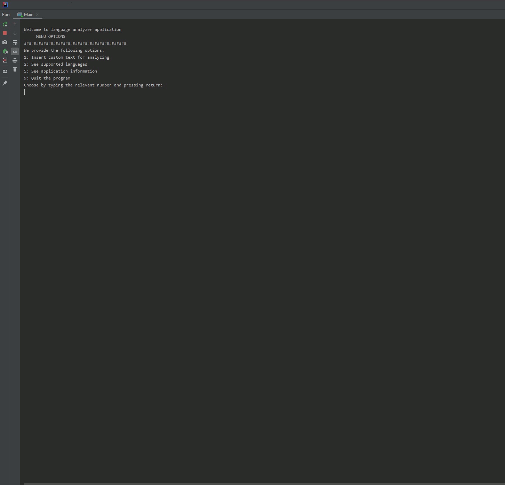

# Datastrukturer och algoritmer (2019-20)
###### PROJEKT 1 - RuttsökningFunktioner
Projekt 2 är ett java program som läser in texter och beräknar vilket språk texten mest sannolikt härstammar från.

##Uppgift
Bygg ett program som läser språk.
Språk i olika text filer finns i projektet.

## Installation
Bygg som ett vanligt java projekt.

## Körning

## Contribution
Project highly unlikely to be updated or modified after completion but any constructive criticism is welcome!

